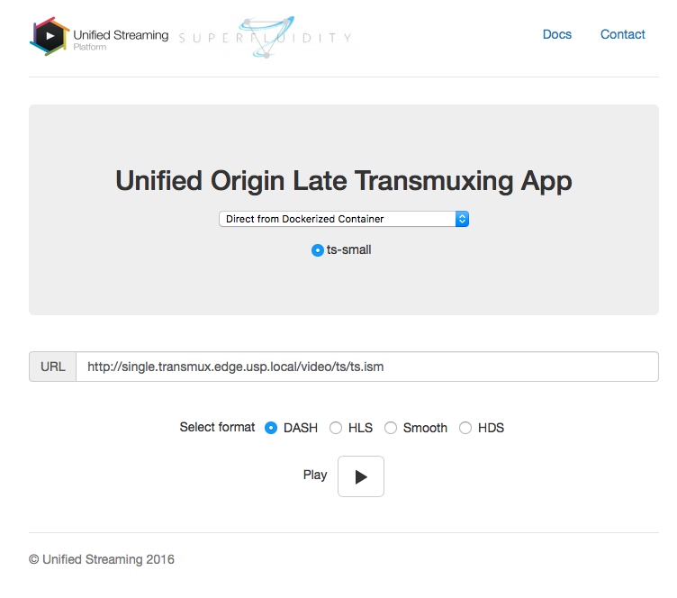

# late-transmuxing
This is the docker version implementation of late-transmuxing (LTM) described in the paper : 

*Rufael Mekuria, Jelte Fennema, Dirk Griffioen, Multi-protocol video delivery with late transmuxing, ACM Multimedia 2016 Amsterdam, The Netherlands*

LTM works by putting transmuxing functionality at the edge. The setup is implemented as follows : 

client -> proxy1 -> origin-edge -> proxy2 -> origin-backend

Moreover, `jwilder-proxy` is also used as a proxy connecting the inner part of the LTM (from `proxy1` all the way to the `origin-backend`) with the client.

## Instructions for 1 Host
1. This setup assumes that you will only run the LTM services under one host (so the Edge and Backend functionality resides within the same host). The communication between the Edge and Backend will be conducted inside the docker network.
2. Put the folder ```ltm-singlehost``` into your designated machine.
3. Paste the Unified Origin license key into these files : ```apache/edge.usp.local/config/key``` and ```apache/origin.usp.local/config/key```
3. Run ```sudo ./docker-compose up``` to activate the LTM services.

## Instructions for 2 Hosts
1. This setup assumes that you have 2 VM called ```ltm-edge``` and ```ltm-backend```.
2. The ltm-edge will hosts ```proxy1```, ```origin-edge``` and ```proxy2```. It will also host ```ltm-demo``` webpage as well as the ```jwilder-proxy``` for the client-facing interface.
3. The ```ltm-backend``` will host ```origin-backend``` and the video sources.
4. Put the folder ```ltm-edge``` and ```ltm-backend``` into the corresponding VM (for instance, in an ubuntu server, you may put it under ```/home/ubuntu```).
5. Change the ```$IP_Backend``` environment variable in ```ltm-edge/run.sh``` with the IP of ltm-backend.
6. Paste the Unified Origin license key into these files : ```apache/edge.usp.local/config/key``` (located at the `ltm-edge`) and ```apache/origin.usp.local/config/key``` (located at `ltm-backend`).
7. Run in both VM, ```sudo ./run.sh``` to build the containers and activate the services.

## DNS Mapping Setup
Whether the LTM services are run in 1 or 2 hosts, a DNS mapping in the client side is needed to access the LTM-demo webpage correctly. Set the local ```hosts``` file (Windows) or ```/etc/hosts``` (*NIX) to add the following mapping : 

```
IP_EDGE ltm.demo.usp.local
IP_BACKEND origin.usp.local
IP_EDGE cdn.edge.usp.local
IP_EDGE nocache.cdn.edge.usp.local
IP_EDGE nocache.transmux.edge.usp.local
IP_EDGE double.transmux.edge.usp.local
IP_EDGE single.transmux.edge.usp.local
IP_EDGE nocache.rangeproxy.edge.usp.local
IP_EDGE rangeproxy.edge.usp.local
```

Open http://ltm.demo.usp.local on your web browser to see the LTM-demo webpage : 




--
*Contributor : Rufael Mekuria (rufael@unified-streaming.com) and Reza Aditya Permadi (reditya@gmail.com)*
